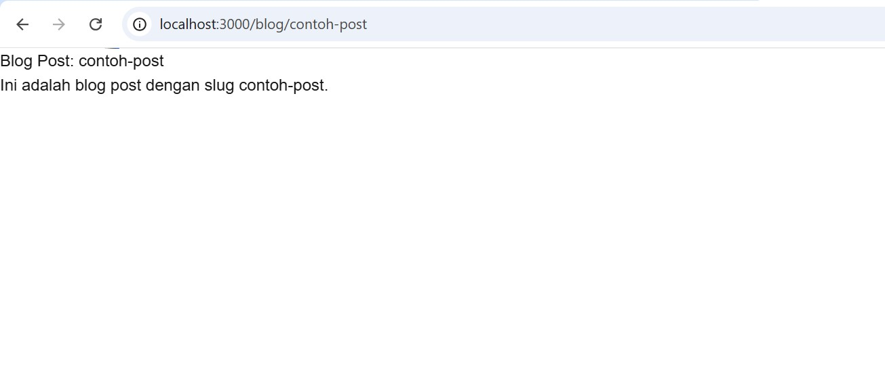

# Week 03 - Pengenalan Next.js

**Nama :** Filla Ramadhani Utomo 
**NIM :** 2241720209 
**Kelas :** TI-3B 
**Absen :** 09

## 1. Persiapan Lingkungan
1. Inisialisasi proyek Next.js dengan menjalankan perintah berikut: Perhatikan bahwa App Router
belum digunakan 

## 2. Membuat Halaman dengan Server-Side Rendering (SSR)

## 3. Menggunakan Static Site Generation (SSG) 

## 4. Menggunakan Dynamic Routes 

## 5. Menggunakan API Routes 

## 6. Menggunakan Link Component 

 
 

## Tugas 
1. Buat halaman baru dengan menggunakan Static Site Generation (SSG) yang menampilkan daftar
pengguna dari API https://jsonplaceholder.typicode.com/users. 

 

 

2. Implementasikan Dynamic Routes untuk menampilkan detail pengguna berdasarkan ID.

 

 

3. Buat API route yang mengembalikan data cuaca dari API eksternal (misalnya, OpenWeatherMap)
dan tampilkan data tersebut di halaman front-end. 

 

 
 

 
 
