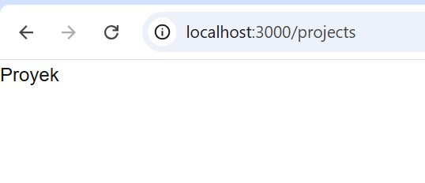
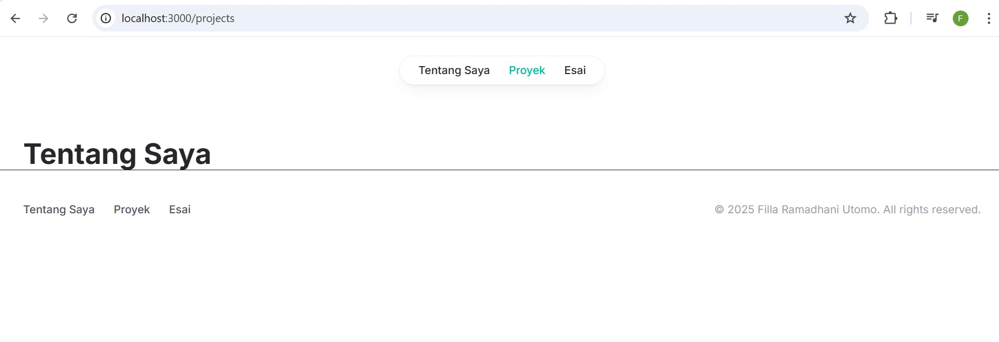
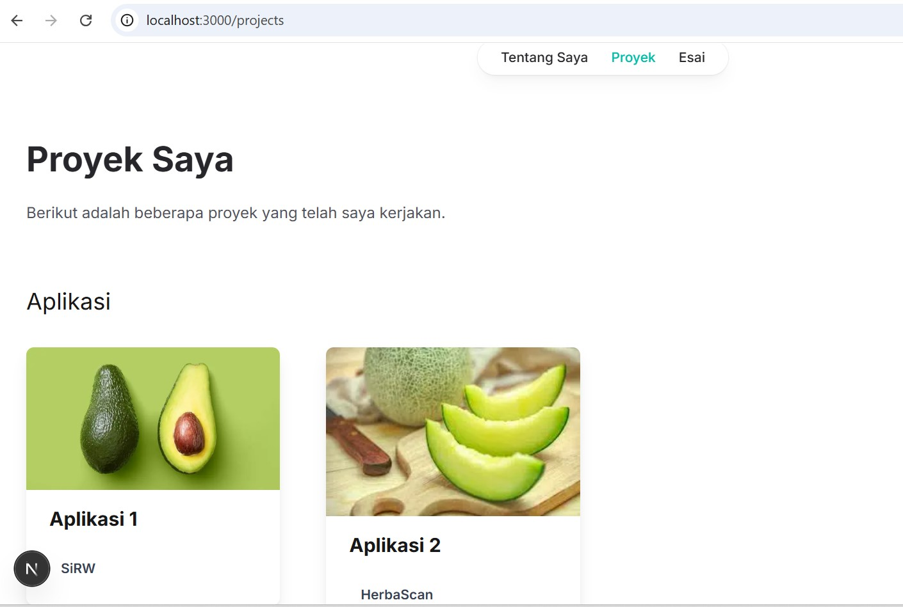

# Week 05 - Membangun Website Pribadi dengan Next.js

**Nama :** Filla Ramadhani Utomo 
**NIM :** 2241720209 
**Kelas :** TI-3B 
**Absen :** 09

## 1. Persiapan Lingkungan
1. Inisialisasi proyek Next.js dengan TypeScript dan App Router:

2. Jalankan aplikasi Next.js

## 2. Membuat Halaman Website

o http://localhost:3000/ untuk halaman "Tentang Saya".

o http://localhost:3000/projects untuk halaman "Proyek".

o http://localhost:3000/essays untuk halaman "Esai".

## 3. Membuat Layout dan Navigasi

o Untuk halaman "Tentang Saya".

o Untuk halaman "Proyek".

o Untuk halaman "Esai".

## 4. Membuat Halaman Proyek dengan Grid Responsif

o Untuk halaman "Proyek".

## Tugas

o Untuk halaman "Esai".

o Untuk halaman "Tentang Saya".
