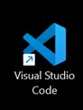

# Week 01 - PENGANTAR PEMROGRAMAN BERBASIS FRAMEWORK DAN REACTJS

**Nama :** Filla Ramadhani Utomo 
**Kelas :** TI-3B 
**NIM :** 2241720209 
**Absen :** 09

##  Praktikum 1: Menyiapkan Lingkungan Pengembangan
### Pertanyaan Praktikum 1

1. Jelaskan kegunaan masing-masing dari Git, VS Code dan NodeJS yang telah Anda install pada sesi praktikum ini! 
> **Git** adalah sistem kontrol versi (Version Control System) yang digunakan untuk melacak perubahan dalam kode sumber suatu proyek. **VS Code** adalah editor kode sumber yang ringan namun memiliki fitur lengkap untuk pengembangan perangkat lunak. **Node.js** adalah runtime JavaScript berbasis V8 Engine yang memungkinkan eksekusi JavaScript di luar browser.
2. Buktikan dengan screenshoot yang menunjukkan bahwa masing-masing tools tersebut
telah berhasil terinstall di perangkat Anda!
>   

 

 

 

## Praktikum 2: Membuat Proyek Pertama React Menggunakan Next.js 
 

 

### Pertanyaan Praktikum 2

1. Pada Langkah ke-2, setelah membuat proyek baru menggunakan Next.js, terdapat beberapa 
istilah yang muncul. Jelaskan istilah tersebut, TypeScript, ESLint, Tailwind CSS, App 
Router, Import alias, App router, dan Turbopack!
> **TypeScript** adalah bahasa pemrograman berbasis JavaScript dengan fitur static typing, membuat kode lebih aman dan terstruktur.

> **Eslint** adalah alat untuk mengecek dan memperbaiki kesalahan dalam kode JavaScript/TypeScript.

> **Tailwind CSS** adalah framework CSS berbasis utility-first yang memudahkan styling tanpa perlu menulis banyak CSS.

> **App Router** sistem routing baru di Next.js yang menggunakan folder app/, mendukung server components untuk performa lebih baik.

> **Import alias** adalah fitur di JavaScript/TypeScript yang memungkinkan pengembang menggunakan jalur (path) yang lebih pendek dan mudah dibaca saat mengimpor file.

> **Turbopack** adalah bundler baru yang dikembangkan oleh Vercel (pembuat Next.js) untuk menggantikan Webpack dan meningkatkan kecepatan pengembangan.

2. Apa saja kegunaak folder dan file yang ada pada struktur proyek React yang tampil pada 
gambar pada tahap percobaan ke-3! 
> a. Folder .next/ 
 
Folder hasil build yang dibuat oleh Next.js.
 
> b. Folder node_modules/
 
Folder tempat semua dependensi
 
> c. Folder public/
 
Menyimpan file statis seperti gambar, favicon, atau file lainnya.
 
> d. Folder src/app/
 
Folder utama untuk manajemen halaman di Next.js.
 
> e. File .gitignore 
 
Menentukan file atau folder yang harus diabaikan oleh Git, seperti node_modules/ dan .next/
 
> f. File eslint.config.mjs
 
Konfigurasi ESLint untuk memastikan kode JavaScript/TypeScript tetap bersih dan bebas dari bug.
 
> g. File next-env.d.ts
 
File deklarasi TypeScript yang dibuat otomatis oleh Next.js untuk dukungan TypeScript.
 
> h. File next.config.ts
 
File konfigurasi untuk Next.js, misalnya untuk mengatur basePath, i18n, webpack, dll.
 
> i. File package-lock.json
 
Menyimpan daftar dependensi proyek dan skrip yang bisa dijalankan (npm run dev, dll.).
 
> j. File package.json
Menyimpan versi pasti dari paket yang di-install untuk memastikan konsistensi.
 
> k. File postcss.config.mjs
 
Konfigurasi PostCSS, sering digunakan untuk mengelola Tailwind CSS atau CSS otomatis lainnya.
 
> l. File README.md
 
Dokumentasi proyek.
 
> m. File tailwind.config.js
 
Konfigurasi untuk Tailwind CSS, seperti pengaturan warna, font, dan kustomisasi lainnya.
 
> n. File tsconfig.json
 
Konfigurasi TypeScript, menentukan aturan seperti strict mode, paths alias, dll.

3. Buktikan dengan screenshoot yang menunjukkan bahwa tahapan percobaan di atas telah 
berhasil Anda lakukan! 
> 

## Praktikum 3: Menambahkan Komponen React (Button)
### Pertanyaan Praktikum 3 

1. Buktikan dengan screenshoot yang menunjukkan bahwa tahapan percobaan di atas telah 
berhasil Anda lakukan! 
> 

## Praktikum 4: Menulis Markup dengan JSX
### Pertanyaan Praktikum 4 

1. Untuk apakah kegunaan sintaks user.imageUrl? 
> Sintaks user.imageUrl digunakan untuk mengambil alamat URL gambar yang terkait dengan pengguna. Misalnya, jika ada pengguna yang memiliki gambar profil, user.imageUrl akan memberikan alamat gambar tersebut, seperti link ke foto profil pengguna. 
2. Buktikan dengan screenshoot yang menunjukkan bahwa tahapan percobaan di atas telah 
berhasil Anda lakukan! 
> 

